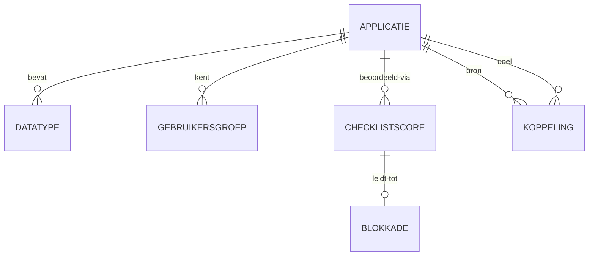

# ADR-009 — BWB-ontvlechtingsmodule: scope en datamodel

| | |
|---|---|
| **Status** | Aanvaard |
| **Datum** | 2026-06-05 |
| **Beslissers** | Bert van Capelle (G. van Capelle Beheer B.V.) |
| **Gerelateerd** | ADR-001 (module-structuur), ADR-003 (RLS), ADR-005 (API), ADR-006 (audit), ADR-008 (blob), ADR-010 (RBAC) |

## Context

`bwb_ontvlechting` is de **eerste functionele module** van LIKARA.

**BWB** = **Bedrijfsvoeringsorganisatie West-Betuwe**, een gemeenschappelijke
regeling (GR) van drie gemeenten: **Tiel, Culemborg en West-Betuwe**. Gemeente
**Tiel treedt uit** de GR. **Ontvlechting** is het gecontroleerd
inventariseren, analyseren en voorbereiden van de overdracht van applicaties en
data die met de BWB verweven zijn.

De module ondersteunt fase 1 (inventarisatie + geschiktheidsbeoordeling +
overdrachtsvoorbereiding). Bestuurlijke besluitvorming gebeurt buiten de tool
(fase 2); de module levert daarvoor de input.

## Functionele scope

**Doel / eindproduct**
1. Volledig **applicatie- en dataregister** van het BWB-landschap.
2. **Migratie-geschiktheidsbeoordeling** per applicatie via een gestructureerde
   checklist.
3. **Overdrachtsvoorbereiding**: data-contracten en migratievoorwaarden per
   applicatie (afgeleide output uit register + checklist).
4. Geheel = **input voor bestuurlijke besluitvorming in fase 2**.

**Databronnen (fase 1)**
- Handmatige invoer door ICT-medewerkers BWB en de projectleider.
- **Bulkimport via Excel/CSV** voor initieel laden (150+ applicaties verwacht).
- Geen API-koppelingen of geautomatiseerde import in fase 1.

**Buiten scope (fase 1)**
- In-tool besluitvorming en vier-ogen-/goedkeuringsflows.
- Geautomatiseerde data-migratie zelf (de module bereidt voor, voert niet uit).

## Besluit — platform-bepaald

### B1 — Plaatsing en isolatie
Module onder `modules/bwb_ontvlechting/` (`backend/{routes,models,services,schemas}`,
`frontend/{views,store}`, `migrations/`), conform ADR-001 B2/B4. Geen
code-afhankelijkheden naar andere modules.

### B2 — Tenant-scoping
Alle module-tabellen tenant-scoped: `tenant_id` + `ENABLE`/`FORCE ROW LEVEL
SECURITY` + `tenant_isolation`-policy (ADR-003). Elke query in module-code
bevat een expliciete `tenant_id`-filter naast RLS.

### B3 — API
Endpoints onder `/api/v1/...`, router geregistreerd in `backend/app/main.py`.
Cursor-paginering en standaard foutformaat (ADR-005). Server-only velden
(`tenant_id`, `id`, timestamps, afgeleide statussen) nooit in input-schemas;
Pydantic `extra='forbid'` op alle schemas.

### B4 — Bestandsopslag
Geüploade import-bestanden (Excel/CSV) en eventuele bijlagen via de blob-store
(MinIO, bucket-per-tenant, ADR-008) — nooit directe S3-toegang buiten de
applicatielaag.

### B5 — Audit
Mutaties op ontvlechtings-data worden vastgelegd in een append-only,
hash-chained audit trail (ADR-006). De rol **Auditor** heeft uitsluitend
toegang tot auditlog en export.

## Datamodel

Zes kern-entiteiten, alle tenant-scoped. **Applicatie** is het centrale object.



### Applicatie (centraal object)
| Veld | Type | Toelichting |
|---|---|---|
| id | uuid (PK) | server-gegenereerd |
| tenant_id | uuid | RLS-anker |
| naam | tekst | verplicht |
| beschrijving | tekst | optioneel |
| hostingmodel | enum | `on_premise` / `private_cloud` / `saas` / `iaas` / `paas` / `hybride` / `onbekend` ¹ |
| eigenaar_organisatie | tekst | vrije tekst (`String`), configureerbaar per tenant — bewust géén hardcoded enum ¹ |
| eigenaar_naam | tekst | functioneel/technisch eigenaar (persoon) |
| leverancier | tekst | optioneel |
| migratiepad | enum | `lift_and_shift` / `herbouw` / `vervangen` / `uitfaseren` / `tijdelijk_gedeeld` / `onbekend` ¹ |
| complexiteit | enum | `laag` / `midden` / `hoog` |
| prioriteit | enum | `laag` / `midden` / `hoog` |
| lifecycle_status | enum | zie §Lifecycle |
| created_at / updated_at | timestamptz | TimestampMixin |

### Datatype (1-op-veel → Applicatie)
| Veld | Type | Toelichting |
|---|---|---|
| id, tenant_id | uuid | |
| applicatie_id | uuid (FK → Applicatie) | ON DELETE CASCADE binnen tenant-scope |
| categorie | enum | `gestructureerd_db` / `documenten` / `email` / `spatial` / `binair` / `combinatie` ¹ |
| omschrijving | tekst | optioneel |
| omvang_indicatie | tekst | optioneel (bijv. "≈ 2 TB", "150k records") |

### Gebruikersgroep (1-op-veel → Applicatie)
| Veld | Type | Toelichting |
|---|---|---|
| id, tenant_id | uuid | |
| applicatie_id | uuid (FK → Applicatie) | |
| organisatie | tekst | vrije tekst (`String`), gebruikende organisatie/afdeling — bewust géén hardcoded enum ¹ |
| afdeling | tekst | optioneel |
| aantal_gebruikers | int | optioneel |

### Koppeling (veel-op-veel Applicatie ↔ Applicatie)
| Veld | Type | Toelichting |
|---|---|---|
| id, tenant_id | uuid | |
| bron_applicatie_id | uuid (FK → Applicatie) | |
| doel_applicatie_id | uuid (FK → Applicatie) | CHECK `bron ≠ doel` |
| richting | enum | `eenrichting` / `tweerichting` |
| protocol | enum | `api` / `bestandsuitwisseling` / `database_link` / `middleware` / `overig` ¹ |
| impact_bij_verbreking | enum | `laag` / `midden` / `hoog` / `kritiek` |
| omschrijving | tekst | optioneel |

### Checklistscore (1-op-veel → Applicatie)
| Veld | Type | Toelichting |
|---|---|---|
| id, tenant_id | uuid | |
| applicatie_id | uuid (FK → Applicatie) | |
| vraag_code | tekst | verwijst naar een vaste checklist-vraag ² |
| score | enum | `ja` / `deels` / `nee` / `nvt` |
| bevinding | tekst | onderbouwing |
| eigenaar | tekst | verantwoordelijke voor opvolging |
| actie | tekst | benodigde actie |
| created_at / updated_at | timestamptz | |

### Blokkade (afgeleid van Checklistscore)
Ontstaat wanneer een Checklistscore `nee` of `deels` is. Heeft een **eigen**
opvolgingsstatus, los van de score zelf.
| Veld | Type | Toelichting |
|---|---|---|
| id, tenant_id | uuid | |
| checklistscore_id | uuid (FK → Checklistscore, 1-op-1) | bron van de blokkade |
| applicatie_id | uuid (FK → Applicatie) | gedenormaliseerd voor filtering |
| status | enum | `open` / `in_behandeling` / `opgelost` |
| toelichting | tekst | |
| eigenaar | tekst | |
| opgelost_op | timestamptz | nullable |

**Voetnoten**
- ¹ **Vastgesteld in code — `modules/bwb_ontvlechting/backend/models/models.py` is de
  single source** (de Alembic-migratie `0001_bwb_initial.py` is daarmee in
  overeenstemming). De hier getoonde waardesets zijn bijgewerkt naar de werkelijke
  code (CD013 / OP-17). DB enum-DDL, Pydantic en UI-dropdown worden synchroon
  gehouden met `models.py`. Bewuste keuzes t.o.v. de oorspronkelijke voorstellen:
  `hostingmodel` telt 7 waarden (`iaas`/`paas` toegevoegd); `migratiepad` 6
  (`tijdelijk_gedeeld` toegevoegd); `datatype.categorie` 6 (`combinatie` toegevoegd,
  CD003); `koppeling.protocol` is een **vaste enum** (geen vrije tekst);
  `eigenaar_organisatie` en `gebruikersgroep.organisatie` zijn **vrije tekst**
  (configureerbaar per tenant, géén hardcoded organisatie-enum — zie verboden
  patronen in CLAUDE.md).
- ² De **checklist-vragenlijst** (de vaste set vragen) wordt als
  referentie-/seeddata gemodelleerd; exacte vragen worden bij implementatie
  aangeleverd. Eén `Checklistscore`-rij per (applicatie × vraag).

## Lifecycle (Applicatie)

Statussen en toegestane overgangen — gehandhaafd op de **service-laag** (geen
DB-enum-afdwinging van transities), conform ADR-001.

```
concept            → in_inventarisatie     start inventarisatie
in_inventarisatie  → checklist_compleet    alle checklistvragen gescoord
checklist_compleet → geblokkeerd           ≥ 1 open blokkade aanwezig
checklist_compleet → migratieklaar         geen open blokkades
geblokkeerd        → migratieklaar         alle blokkades status 'opgelost'
```

`geblokkeerd` en `migratieklaar` zijn afgeleid van de blokkade-status; de
service-laag herberekent de applicatie-status bij elke wijziging van een
Checklistscore of Blokkade.

> **Geamendeerd door [ADR-013](ADR-013_lifecycle-herberekening.md) (B4):**
> `checklist_compleet` is **transient**. De enum-waarde blijft in het datamodel
> bestaan (geen migratie/datamodelwijziging), maar de deterministische
> herberekening kent hem **nooit als ruststatus toe** — "alle vragen gescoord" is
> een doorgangsmoment dat onmiddellijk naar `geblokkeerd` of `migratieklaar` leidt.

## Rollen (→ ADR-010)

Module-rollen; formele RBAC-uitwerking in ADR-010.

| Rol | Rechten |
|---|---|
| Viewer | Lezen — geen wijzigingen |
| Medewerker | Aanmaken en bewerken |
| Beheerder | Volledig, incl. verwijderen en gebruikersbeheer |
| Auditor | Alleen auditlog en export |

Geen vier-ogen-principe in fase 1.

## Gevolgen

- Het datamodel is vastgesteld; de eerste Alembic-migratie + SQLAlchemy-modellen
  kunnen in de volgende sessie worden gebouwd in `modules/bwb_ontvlechting/`.
- Bulkimport (Excel/CSV, 150+ applicaties) is een eigen service met validatie
  per rij; geüploade bestanden via de blob-store (B4).
- Enum-waardesets (¹) en de checklist-vragenlijst (²) worden bij implementatie
  definitief gemaakt en synchroon gehouden over DB/API/UI.

## Alternatieven overwogen

- **Koppeling als attribuut op Applicatie** i.p.v. eigen entiteit — verworpen:
  koppelingen zijn veel-op-veel met eigen eigenschappen (richting, protocol,
  impact) en horen als zelfstandige entiteit.
- **Blokkade als status-veld op Checklistscore** i.p.v. eigen entiteit —
  verworpen: een blokkade heeft een eigen opvolgingslevenscyclus
  (open → in_behandeling → opgelost) los van de score.
